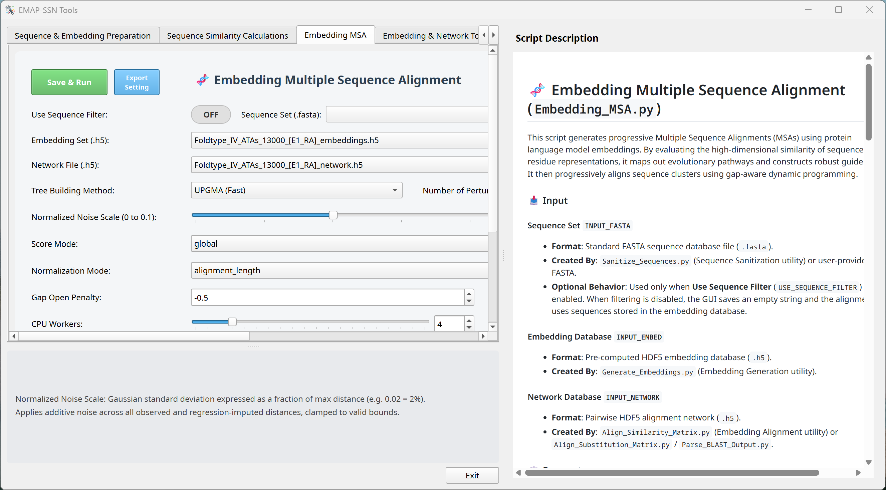
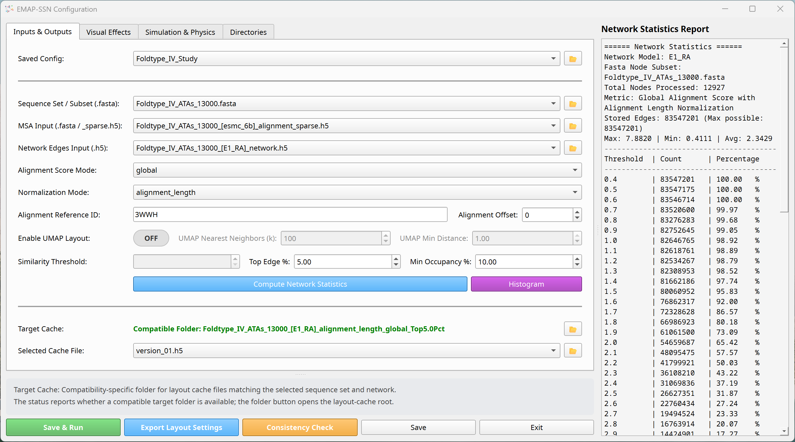
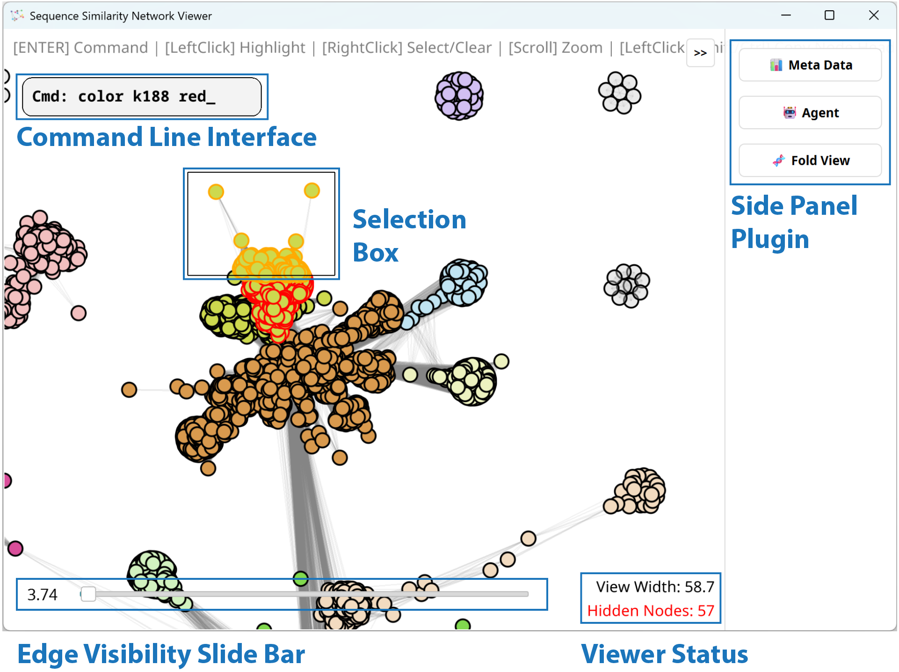
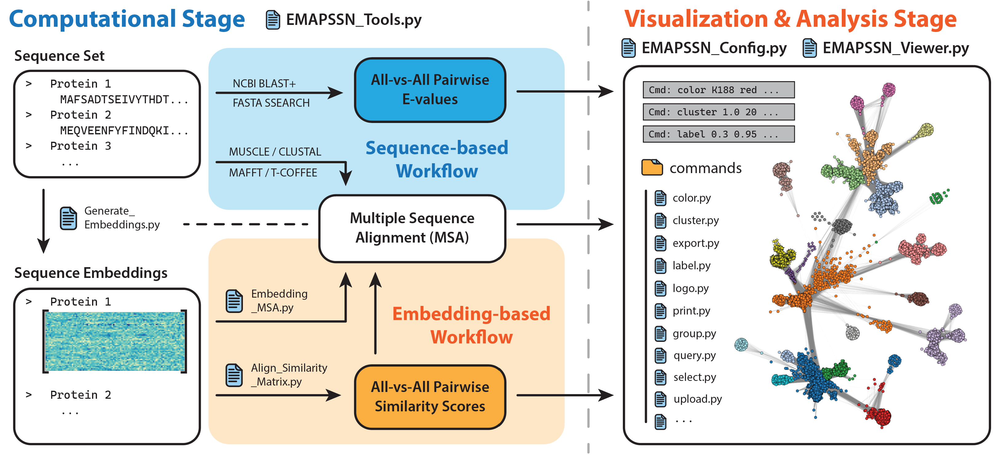

# EMAP-SSN

[](https://www.python.org/)
[-lightgrey.svg)](https://github.com/Xuebin-Feng/EMAP-SSN)
[](LICENSE)
[](https://doc.qt.io/qtforpython/)
[](https://vispy.org/)

**EMAP-SSN: Embedding- and Multiple-Alignment-integrated Protein Sequence
Similarity Network Platform** is an interactive, high-performance
graphical application for generating, visualizing, and analyzing traditional
and embedding-based Sequence Similarity Networks (SSNs). By integrating
Multiple Sequence Alignments (MSAs) directly into network exploration, the
platform bridges macroscopic sequence relationships with microscopic
residue-level conservation to provide a multi-scale view of protein sequence
space.

---
## ⚠️ Important Note

1. **Cross-Platform Support**: Host architecture, operating-system, and accelerator support is conditional. See [Compatibility](#-compatibility) before installation; Linux and Apple Silicon macOS support remains under active development.
2. **Work in Progress**: This documentation and the repository structure are undergoing active updates.
3. **Recommended Hardware**: A compatible **NVIDIA GPU** is highly recommended for CUDA acceleration of embeddings and layout solvers. Selected AMD and Intel devices and Apple Silicon GPUs can use the backends listed in [Compatibility](#-compatibility); every accelerator must pass runtime validation.

---

## 📸 Overview

The application streamlines the entire SSN pipeline—from generation to interactive analysis—within a single unified workflow. It supports both traditional sequence similarity methods (e.g., BLAST) and modern embedding-based language model algorithms. Beyond dynamic visual formatting, the viewer provides an interactive command console with specialized commands tailored for deep analysis of the protein sequence space (see the [Viewer Command Reference](docs/list_of_commands.html) for detailed usage and examples).

---
## 🖥️ Graphical User Interface

### 🛠️ EMAP-SSN Tools GUI

All calculations related to SSN generation are centralized in the `EMAPSSN_Tools.py` GUI. The interface is organized into intuitive tabs, each representing a distinct stage of the pipeline. It includes interactive tooltips at the bottom for parameter input fields and a script description panel on the right highlighting the function of each processing script.



Each tool card also provides **Export Setting** below **Save & Run**. The
Directories tab controls the export location through **Setting Export
Directory**, which defaults to `Cache_Files/Tool_Settings/`. An exported file
contains the current settings for one tool and only the global directories
used by that tool. For example:

```json
{
  "DIRECTORIES": {
    "FASTA_DIR": "Input_Files/Sequence_Sets"
  },
  "Sanitize_Sequences.py": {
    "INPUT_FASTA": "example.fasta",
    "OVER_WRITE": false
  }
}
```

Run any exported configuration as the sole positional argument to its tool:

```powershell
# Windows
.\.venv\Scripts\python.exe src\tools\Sanitize_Sequences.py Cache_Files\Tool_Settings\example.json
```

```bash
# Linux or macOS
./.venv/bin/python src/tools/Sanitize_Sequences.py Cache_Files/Tool_Settings/example.json
```

The settings-file argument is resolved from the terminal's current working
directory. Directory values inside the JSON retain the GUI representation:
absolute paths remain absolute, while relative paths are resolved from the
project root. Omitting the argument preserves the GUI-compatible behavior of
reading `tools_settings.json` from the project root. Model acknowledgement remains a
separate command, for example
`python src/tools/Generate_Embeddings.py --accept-model-license MODEL_ID`.

### 🔌 Local STDIO MCP server

`src/EMAPSSN_MCP_Server.py` exposes the 14 pipeline programs and bounded,
read-only Viewer inspection to local MCP clients. It uses STDIO only: the
client starts one server process and communicates through its standard input
and output. Run the normal project installer after updating this branch so the
managed environment includes the pinned MCP SDK.

Use absolute paths in client configuration. On Windows, replace `<PROJECT>`
below with the absolute repository path:

```powershell
# Codex
codex mcp add emapssn -- "<PROJECT>\.venv\Scripts\python.exe" "<PROJECT>\src\EMAPSSN_MCP_Server.py"

# Claude Code (user scope)
claude mcp add --transport stdio --scope user emapssn -- "<PROJECT>\.venv\Scripts\python.exe" "<PROJECT>\src\EMAPSSN_MCP_Server.py"
```

For VS Code, add this to the appropriate `mcp.json` file:

```json
{
  "servers": {
    "emapssn": {
      "type": "stdio",
      "command": "<PROJECT>\\.venv\\Scripts\\python.exe",
      "args": ["<PROJECT>\\src\\EMAPSSN_MCP_Server.py"]
    }
  }
}
```

Antigravity and clients using the common `mcpServers` form, including many
open-source harnesses, can use:

```json
{
  "mcpServers": {
    "emapssn": {
      "command": "<PROJECT>\\.venv\\Scripts\\python.exe",
      "args": ["<PROJECT>\\src\\EMAPSSN_MCP_Server.py"]
    }
  }
}
```

On Linux or macOS, use `<PROJECT>/.venv/bin/python` and forward-slash paths.
No environment activation or wrapper script is required. A harness with a
different configuration schema needs only the same executable and server-file
arguments over its local STDIO transport.

The MCP server provides a generic pipeline catalog plus start, status, log,
and cancellation tools. A start request accepts either the exported JSON
document itself or a path to that document. Each client connection owns one
FIFO with one running and at most 16 pending jobs. Closing or restarting that
client terminates its running job and cancels its queued jobs; different MCP
clients do not share a queue and can start conflicting calculations. Pipeline
jobs may create or overwrite files according to their settings, and cancelling
a job does not roll back files already written.

Job responses report captured stdout/stderr, the immutable settings snapshot,
and the configured result directories. They do not guess the exact scientific
files produced by a program. MCP-owned logs and snapshots are temporary and
are removed on normal server shutdown; an abrupt crash can leave a private
`sequence_similarity_network_viewer/mcp_jobs/server-*` directory below the
operating system's temporary directory, which is safe to remove when no MCP
server is running.

Viewer tools discover normally running Viewer processes and reuse their
authenticated, loopback-only inspection endpoints. They cannot modify the
Viewer. When multiple Viewers are open, callers must provide a session ID.
Discovery tokens and descriptor paths are never returned by MCP tools.

### ⚙️ EMAP-SSN Configuration GUI

The configuration GUI in `EMAPSSN_Config.py` simplifies input file selection and parameter tuning for SSN generation. Each tab has a **Saved Config** selector: `(custom)` values are kept together in the project-root `viewer_settings.json`, while named per-tab JSON profiles are stored below the directory selected on the Directories tab. Its default expression is `$cache_file$/Saved_Config`, which resolves to `Cache_Files/Saved_Config/` with the default Cache File Directory. Selecting `(default)` loads read-only built-in values, and `(new)` creates a named profile from the settings currently shown. Directory values may begin with `$input_file$`, `$cache_file$`, or `$analysis_result$` to resolve beneath the corresponding configurable base directory; ordinary relative and absolute paths retain their existing behavior.

The GUI also features a **Compute Network Statistics** utility that analyzes network density and outputs a report in the right panel to guide selection of an optimal similarity cutoff. The **Consistency Check** utility compares the similarity network against the Multiple Sequence Alignment (MSA) to ensure sequence headers and indexes match across all files.



### 🔍 EMAP-SSN Viewer GUI

The main visualization window, `EMAPSSN_Viewer.py`, serves as the interactive core for network exploration, formatting, and analysis. It provides full mouse and keyboard controls for 3D navigation and graphic customization, along with an in-line command console (HUD) to execute analytical operations, highlight specific residues, select clusters, and export figures.



---
## 🧬 System Workflow

The pipeline supports two primary pathways for Sequence Similarity Network (SSN) generation: a **traditional pathway** utilizing sequence alignment algorithms (like BLAST) and an **embedding-based pathway** driven by protein language models. Additionally, users can project sequences into 2D/3D space using UMAP based on pre-calculated embedding representations.



---

## 🚀 Key Features

*Work in Progress*

*   **Embedding-Based Dynamic Programming Alignment**: Align sequences using high-dimensional dense embedding similarity vectors instead of simple substitution matrices (BLOSUM/PAM), resolving structural and functional relationships even at low sequence identity.
*   **High-Performance Visualization**: Powered by PySide6 and VisPy, allowing real-time rendering, rotation, zooming, and manipulation of large networks containing thousands of nodes and edges.
*   **Integrated Command Console (HUD)**: Execute analytical commands (such as `zoom`, `select`, `color`, `cluster`, `subcluster`, and `logo`) directly inside the viewer viewport for instant formatting and analysis.
*   **Integrated Multiple Sequence Alignments (MSA)**: Bridge macroscopic network topology with residue-level conservation. Map conservation scores directly onto nodes and extract consensus sequence details interactively.
*   **Comprehensive Utilities Suite**: Centralized GUI in `EMAPSSN_Tools.py` supporting sequence sanitization, embedding generation (ESM, ProtBERT, ProstT5), network edge filtering, guide-tree MSA generation, and sequence extraction/injection.
*   **Cross-Platform Hardware Acceleration**: Automatic eligibility checks and runtime validation for supported NVIDIA CUDA, AMD ROCm, Intel XPU, and Apple MPS configurations, with safe fallback to CPU.

---

## ✅ Compatibility

*Compatibility snapshot: August 2026.* Compatibility is the intersection of
the application detector, the pinned Python packages, the operating system,
and the installed GPU driver. A device can be eligible for an installation
attempt without being guaranteed to work; the installer records it as
validated only after a tensor calculation succeeds on that device.

The status terms used below are:

- **Tested:** the application has been run on that operating-system family.
- **Supported:** the current installer and pinned upstream binary matrix cover
  the configuration.
- **Provisional:** the detector can attempt it, but the configuration has not
  been project-tested or is outside a fully validated upstream combination.
- **Unsupported:** the current managed Python 3.12 dependency set cannot be
  installed or the application deliberately excludes the configuration.

### Operating systems and processor architectures

| Platform | Status | Requirements and limits |
| --- | --- | --- |
| Windows x64 | Supported | CPU use requires Windows 10 version 1809 or newer. NVIDIA CUDA requires Windows 10 22H2 or Windows 11. Native AMD ROCm and Intel XPU require Windows 11; Windows 11 25H2 build 26200+ is required for the ROCm 7.14 profile. Windows 11 is recommended. |
| Windows x86 (32-bit) | Unsupported | The pinned binary dependencies do not provide Win32 wheels. |
| Windows ARM64 | Unsupported | Python 3.12 and `uv` exist for ARM64, but the pinned PyTorch 2.12.1 Python 3.12 CPU artifact and the CUDA, XPU, and ROCm builds used by this project do not provide a complete native ARM64 environment. Running the x64 environment under Windows emulation is not project-supported. |
| Linux x86_64 | Tested on Ubuntu and Debian | Exact tested release numbers were not recorded. The pinned Qt wheel requires glibc 2.34 or newer; Ubuntu 22.04+ and Debian 12+ satisfy that baseline. The installer automates GUI system dependencies only on Debian-family systems. |
| Other x86_64 Linux distributions | Provisional | Modern glibc-based distributions may work after their Qt/XCB/QtWebEngine packages are installed manually. Fedora, RHEL, SUSE, Arch, and other distributions have not been project-tested. Accelerator support remains subject to the narrower vendor tables below. |
| Linux ARM64 and other Linux architectures | Unsupported | Some individual upstream packages publish ARM wheels, but the complete pinned application environment has not been resolved or project-tested on these architectures. |
| macOS ARM64 | Supported | Apple Silicon only, macOS 14 or newer, using MPS or CPU. |
| macOS x86_64 | Unsupported | PyTorch 2.12.1 used by this project does not provide the required Intel macOS runtime. |

The operating-system baseline follows the pinned [Qt 6.11 platform
matrix](https://doc.qt.io/qt-6/supported-platforms.html), the [official PyTorch
wheel index](https://download.pytorch.org/whl/cpu/torch/), and the platform
requirements linked below. "Tested" refers to this application, whereas a
vendor listing alone does not constitute live application testing.

### Accelerator support by platform

| Accelerator | Windows x64 | Linux x86_64 | macOS ARM64 |
| --- | --- | --- | --- |
| CPU | Supported on Windows 10 version 1809+ and Windows 11 | Supported on the tested Ubuntu/Debian families; other distributions are provisional | Supported on macOS 14+ |
| NVIDIA CUDA | CUDA 13.2 or CUDA 12.6 on Windows 10 22H2+/Windows 11 | CUDA 13.2 or CUDA 12.6; distribution and driver must support the selected runtime | Not supported |
| AMD ROCm | Windows 11 only: ROCm 7.14 on 25H2 build 26200+, then ROCm 7.2.1 where eligible | Ubuntu only: ROCm 7.2 first, then ROCm 6.4 for the narrower fallback target set | Not supported |
| Intel XPU | Windows 11 only for supported Arc/Core Ultra Arc devices | Supported only for the device/OS combinations below | Not supported |
| Apple MPS | Not applicable | Not applicable | Supported on Apple Silicon with macOS 14+ |

#### NVIDIA CUDA

| Installer profile | Eligibility | Upstream binary coverage |
| --- | --- | --- |
| CUDA 13.2 | Every selected NVIDIA GPU must report compute capability 7.5 or newer and every driver must be version 580 or newer. | PyTorch 2.12 classifies CUDA 13.2 as experimental and publishes binaries for its listed Turing-and-newer architectures. Unlisted capability values remain provisional until runtime validation succeeds. |
| CUDA 12.6 | Used when the CUDA 13.2 conditions are not met. The effective PyTorch binary floor is compute capability 5.0. | Covers the listed Maxwell, Pascal, Volta, Turing, Ampere, Ada, and Hopper capability generations. Devices below capability 5.0 fall back to CPU. |

CUDA 12.x minor compatibility requires at least NVIDIA driver 525.60.13 on
Linux or 528.33 on Windows; a current vendor driver is recommended. See the
[PyTorch 2.12 support matrix](https://github.com/pytorch/pytorch/blob/main/RELEASE.md),
[current NVIDIA compute-capability table](https://developer.nvidia.com/cuda/gpus),
[legacy capability table](https://developer.nvidia.com/cuda/gpus/legacy), and
[CUDA 12.6 release notes](https://docs.nvidia.com/cuda/archive/12.6.0/cuda-toolkit-release-notes/index.html).

#### AMD ROCm

The application uses a pinned model-to-GFX snapshot and does not guess support
for newly released hardware. The following are application eligibility targets,
not a promise that every product with the same architecture will pass its
driver and tensor validation:

| Platform/profile | Eligible GFX targets | Additional requirements |
| --- | --- | --- |
| Windows ROCm 7.14 / PyTorch 2.12 | `gfx1030`, `gfx1100`, `gfx1101`, `gfx1102`, `gfx1103`, `gfx1150`, `gfx1151`, `gfx1152`, `gfx1200`, `gfx1201` | Windows 11 25H2 build 26200+ and a supported AMD driver. |
| Windows ROCm 7.2.1 / PyTorch 2.9.1 | `gfx1100`, `gfx1101`, `gfx1150`, `gfx1151`, `gfx1152`, `gfx1200`, `gfx1201` | Windows 11 and AMD Software 26.2.2 or newer when the version can be detected. |
| Linux ROCm 7.2 / PyTorch 2.12.1 | `gfx1030`, `gfx1100`, `gfx1101`, `gfx1102`, `gfx1103`, `gfx1150`, `gfx1151`, `gfx1152`, `gfx1200`, `gfx1201` | A listed Ubuntu release, readable and writable `/dev/kfd`, and a matching target from `rocm_agent_enumerator` or `rocminfo`. |
| Linux ROCm 6.4 / PyTorch 2.9.1 fallback | `gfx1030`, `gfx1100`, `gfx1101`, `gfx1200`, `gfx1201` | Same Linux preflight requirements; attempted only after ROCm 7.2 fails. |

The installer does not install the Linux kernel driver or system ROCm stack.
Consult the [ROCm 7.14 matrix](https://rocm.docs.amd.com/en/docs-7.14.0/about/release-notes.html),
[ROCm 7.2.1 Windows matrix](https://rocm.docs.amd.com/projects/radeon-ryzen/en/latest/docs/compatibility/compatibilityrad/windows/windows_compatibility.html),
and [ROCm 6.4 matrix](https://rocm.docs.amd.com/en/docs-6.4.3/compatibility/compatibility-matrix.html)
for the matching operating system, driver, and hardware requirements.

#### Intel XPU

| Device family | Supported operating-system combinations |
| --- | --- |
| Intel Arc A-Series, Arc B-Series, and Core Ultra processors with Arc graphics | Windows 11; Ubuntu 24.04, 25.10, or 26.04 as admitted by the current application snapshot. Ubuntu 26.04 remains project-untested. |
| Core Ultra Series 3 / Panther Lake with Arc graphics | Windows 11; Ubuntu 25.10 or 26.04. Ubuntu 26.04 remains project-untested. |
| Intel Data Center GPU Max | Ubuntu 22.04, RHEL 9.2, or SLES 15. The non-Ubuntu combinations are upstream-listed but project-untested. |
| Intel HD, UHD, Iris, and non-Arc integrated graphics | Not eligible for XPU; another accelerator or CPU is used. |

The Intel driver must already be installed. See the [PyTorch Intel XPU
matrix](https://docs.pytorch.org/docs/stable/notes/get_start_xpu.html) for the
validated hardware and operating-system combinations.

#### Apple MPS

MPS is selected only when both macOS and the `arm64` architecture are detected.
All Apple Silicon generations use the same eligibility rule and must pass the
runtime tensor check; otherwise the environment falls back to CPU. See Apple's
[PyTorch MPS requirements](https://developer.apple.com/metal/pytorch/).

### Backend selection and limitations

- Compatible discrete GPUs are preferred over integrated GPUs; NVIDIA, AMD,
  and Intel are ordered within the same device class.
- One backend-specific PyTorch build is installed per `.venv`. GPUs from
  different vendors cannot be used simultaneously in the same environment.
- Multiple validated NVIDIA or Intel devices can remain available to the
  application's automatic benchmark. For mixed AMD integrated/discrete
  systems, only the preferred GFX target is installed.
- A failed installation or tensor validation advances to the next eligible
  backend and ultimately to CPU.
- The selected backend and validation results are stored in
  `.venv/ssn_backend.json`. Requirements, bundled artifacts, compatibility
  rules, or a change to the required PyTorch profile invalidate the relevant
  saved state. Physical GPU addresses, device enumeration order, and driver
  updates that remain within the same CUDA compatibility profile do not force
  PyTorch to be reinstalled; the existing build is validated and reused.
- A shared HPC `.venv` retains its installed accelerator build when inspected
  from a CPU-only login node. CPU work remains available there, and accelerator
  tensor validation resumes on a compute node. Moving to a genuinely different
  backend profile, such as CUDA 12.6 to CUDA 13.2 or a different ROCm GFX
  target, still selects the required build.
- Run
  `python src/Install_Dependencies.py --refresh-backend` inside the managed
  environment to deliberately reinstall from the currently visible candidate
  ladder. On a CPU-only node, this explicit override selects the CPU build.

---

## ⚙️ Installation Steps

1. **Clone the repository:**
   Download the repository or clone it into a local project directory:

   ```bash
   git clone https://github.com/Xuebin-Feng/EMAP-SSN.git
   cd EMAP-SSN
   ```

2. **Set up the environment:**

   The generated Viewer and Tools launchers create a managed Python 3.12
   environment and automatically install and validate one pinned PyTorch
   backend. Review [Compatibility](#-compatibility) for supported hosts,
   accelerator profiles, drivers, and fallback behavior before continuing.

   * **🪟 Windows**:
     Double-click `install.bat` in the project root to generate Windows Shortcuts (`.lnk` files) in the project root and optionally on your Desktop.

     > [!TIP]
     > It is highly recommended to enable **Developer Mode** in your Windows Settings (Search for "Developer settings" in Windows). This allows symbolic links to be created without elevation, which is required by the Hugging Face `transformers` cache model download system to avoid duplicating file storage.

     > [!IMPORTANT]
     > **Enable long path support.** Windows limits a full path to 260 characters by default, while Linux and macOS allow far longer. Generated outputs — predicted structure `.pdb` files in particular — are named after sequence headers, so a long header inside an already-deep project folder can exceed the limit and fail to write, even though the same run succeeds on Linux or macOS.
     >
     > Run this once in an **Administrator** PowerShell, then reboot:
     > ```powershell
     > New-ItemProperty -Path "HKLM:\SYSTEM\CurrentControlSet\Control\FileSystem" -Name "LongPathsEnabled" -Value 1 -PropertyType DWORD -Force
     > ```
     > Alternatively, enable **Computer Configuration → Administrative Templates → System → Filesystem → "Enable Win32 long paths"** in the Group Policy Editor (`gpedit.msc`).
     >
     > If you cannot change this setting, keep the project close to the drive root (for example `C:\SSN\`) rather than nested under a long folder chain such as a synced OneDrive directory. Note that external binaries invoked by the pipeline, such as NCBI BLAST, may not be long-path aware regardless of this setting — a short project path is the most reliable option.

   * **🍏 macOS (Apple Silicon only)**:
     Open Terminal in the project root, make the installer executable, and run it:

     ```bash
     chmod +x install.sh
     ./install.sh
     ```

     The shared installer detects macOS, configures permissions for scripts in `src/bin/`, and generates Finder-native `EMAP-SSN.app` and `EMAP-SSN Tools.app` launchers in the project root.

     > [!IMPORTANT]
     > Only Apple Silicon Macs are supported. Intel-based Macs are not supported by the pinned PyTorch runtime.

   * **🐧 Linux**:
     Open a terminal in the project root, make the installer executable, and run it:

     ```bash
     chmod +x install.sh
     ./install.sh
     ```

     On Ubuntu/Debian, the installer detects missing Qt xcb and QtWebEngine system libraries and offers to install them with `sudo apt`. These libraries cannot be installed by `pip` or `uv`.

     > [!NOTE]
     > On Fedora/RHEL, install the equivalent system libraries before launching:
     > ```bash
     > sudo dnf install nss nspr libXcomposite libXdamage libXrandr libxkbcommon-x11 \
     >                  libXtst mesa-libgbm mesa-libEGL libxslt alsa-lib cups-libs
     > ```

     This will configure execution permissions and generate launchers (`emapssn` and `emapssn_tools`) as well as system `.desktop` application entries.

3. **Launch the application:**

   - **Windows:** Open `EMAP-SSN.lnk` or `EMAP-SSN Tools.lnk` from the project root or from the Desktop if you selected that installer option.
   - **macOS:** Open `EMAP-SSN.app` or `EMAP-SSN Tools.app` from the project root.
   - **Linux:** Run `./emapssn` or `./emapssn_tools`, or use the generated desktop application entries.

   `emapssn` opens the configuration GUI first. Select the input files and layout settings there, then click **Save & Run** to save the settings and launch the visualization window. On the first application launch, the managed launcher creates `.venv`, installs the pinned dependencies, and validates the selected compute backend; later launches reuse that environment while it remains compatible.

### Headless layout-cache generation

When **(New Layout Cache)** is selected in EMAP-SSN Configuration, **Export Layout
Settings** saves a generation-only JSON file. Run that file with the same
managed Python environment to calculate and save the cache without opening the
viewer:

```text
python -u src/Layout_Cache_Generator.py Cache_Files/Layout_Settings/example.json
```

The JSON contains the selected FASTA/network inputs, exact cache filename, edge
filter, UMAP settings, and all physics-layout settings. It intentionally omits
visual, metadata, command, and analysis settings. Relative paths are resolved
from the project root. The command exits with an error rather than replacing an
existing cache file.

### Additional language fonts

The application bundles a 4.68 MiB Noto Sans/Noto Sans Mono desktop core with
Latin, Greek, Cyrillic, IPA, combining-mark, and common scientific punctuation
coverage. Qt uses fonts installed in the operating system when this core does
not contain a requested glyph.

For another writing system, download the appropriate family from the
[official Noto Fonts site](https://notofonts.github.io/) and install it normally:

- **Windows:** right-click the font file and select **Install** or **Install for
  all users**.
- **macOS:** open the font in Font Book and select **Install Font**.
- **Linux:** copy it to `~/.local/share/fonts/`, run `fc-cache -f`, and restart
  the application.

Copying a font into `src/resources/fonts/desktop/` is not sufficient: Qt does
not scan that directory, and the application registers only the files declared
in its bundled manifest. System-installed fonts become available after the
application is restarted. They can provide fallback in PySide6/Qt widgets, but
VisPy network labels remain limited to the bundled Noto Sans face.

---

## 🔧 Linux Troubleshooting

* **Blank, black, or repeatedly failing 3D canvas on a Wayland session.**
  The Viewer forces `QT_QPA_PLATFORM=xcb` before importing Qt/VisPy. On affected Linux drivers, Qt's native Wayland plugin supplies an OpenGL ES context while VisPy compiles desktop GLSL shaders, producing repeated `Error drawing visual` messages. XWayland/XCB supplies the compatible desktop OpenGL context; the installer includes its required Ubuntu/Debian libraries.

* **The application closes immediately when launched from a desktop icon.**
  The Ubuntu/Debian launchers now check the Qt/XCB libraries before startup and print the exact `sudo apt install` command for anything missing. If any later startup step fails, a desktop-launched terminal remains open until you press Enter so the original error stays visible.

* **EMAP-SSN Tools exits immediately, or crashes inside Chromium.**
  If the documentation panel fails after the libraries above are installed — common inside containers or on hardened kernels where the Chromium sandbox cannot start — disable the sandbox:
  ```bash
  QTWEBENGINE_CHROMIUM_FLAGS=--no-sandbox ./emapssn_tools
  ```

* **`unable to lock file` when opening an HDF5 network.**
  HDF5 file locking fails on NFS and some network home directories. Set `HDF5_USE_FILE_LOCKING=FALSE` before launching.

---

## 📂 File Structure

```directory
EMAP-SSN/
│
├── install.bat               # Windows installer (creates .lnk shortcuts)
├── install.sh                # Linux/macOS installer with platform-specific launchers
│
├── src/                      # Source code directory
│   ├── EMAPSSN_Viewer.py         # Main PySide6 / VisPy desktop visualization application
│   ├── EMAPSSN_Tools.py          # GUI for preparing sequences, embeddings, networks, and alignments
│   ├── EMAPSSN_Config.py         # GUI configuration manager for inputs, thresholds, and models
│   │
│   ├── bin/                  # Startup scripts and launchers
│   │   ├── EMAPSSN.bat          # Windows platform startup script
│   │   ├── EMAPSSN_Tools.bat     # Windows Tools startup script
│   │   ├── EMAPSSN.sh           # Linux/macOS platform startup script
│   │   ├── EMAPSSN_Tools.sh      # Linux/macOS Tools startup script
│   │   ├── EMAPSSN_Desktop_Launcher.bat
│   │   ├── EMAPSSN_Desktop_Launcher.sh
│   │   ├── EMAPSSN_Terminal_Launcher.sh
│   │   └── logos/            # Application custom icon files (.png and .ico)
│   │
│   ├── commands/             # Command modules for interactive viewer console
│   ├── resources/            # Configuration and system prompts
│   ├── tools/                # Executable processing scripts exposed by EMAPSSN_Tools
│   │   └── tool_descriptions/ # Markdown documentation displayed by the Tools GUI
│   ├── utilities/            # Focused cache, network, hardware, alignment, and FASTA helpers
│   └── web_ui/               # Embedded web UI backend and interfaces
│       └── plugins/          # Auto-discovered bundled web-utility descriptors
│
├── docs/                     # Screenshots, command reference, and metadata template
│   └── list_of_commands.html # Interactive Viewer command reference
│
├── viewer_settings.json      # Settings saved by the configuration GUI
├── tools_settings.json       # Shared settings saved by the Tools GUI
│
├── Input_Files/              # Viewer and tool input files
│   ├── Sequence_Sets/        # Protein sequence sets and subsets (.fasta)
│   ├── Multiple_Alignments/  # Full or sparse multiple-sequence alignments
│   ├── Networks_EValues/    # Embedding- or BLAST-derived network files (.h5)
│   ├── Header_Lists/         # Reusable sequence-header cohorts
│   ├── Meta_Data/            # Imported and exported node metadata
│   └── Batch Scripts/        # User batch and helper scripts
│
├── Cache_Files/              # Reusable layouts and intermediate/session artifacts
│   ├── Saved_Layouts/        # Manifest-bound layout snapshots (.h5)
│   ├── Structures/           # Predicted structures and viewer assets
│   └── Tool_Settings/        # Exported per-tool command-line settings
│
├── Embeddings/               # Protein-language-model embedding databases (.h5)
└── Analysis_Results/          # User-facing exported analysis results
    ├── Sequence_Export/       # Extracted sequence subsets
    ├── Alignment_Report/      # Pairwise-alignment reports
    ├── Saved_Images/          # Viewer image exports
    ├── Cluster_Label/         # Cluster and specificity reports
    └── Sequence_Logos/        # Sequence-logo graphics
```

---

## 🤝 Contributing

Contributions are welcome! Please feel free to open Issues or submit Pull Requests to enhance computational efficiency, layout performance, UI responsiveness, or commands for analyses.

Bundled browser utilities use a validated startup-discovery contract. See the
[web-utility plugin development guide](docs/web_plugin_development.md) for the
manifest, registration, activation, and failure-isolation rules.

## 📄 License

Copyright 2026 Xuebin Feng

Licensed under the Apache License, Version 2.0 (the "License"); you may not use
this file except in compliance with the License. You may obtain a copy of the
License at

    http://www.apache.org/licenses/LICENSE-2.0

Unless required by applicable law or agreed to in writing, software distributed
under the License is distributed on an "AS IS" BASIS, WITHOUT WARRANTIES OR
CONDITIONS OF ANY KIND, either express or implied. See the [LICENSE](LICENSE)
file for the specific language governing permissions and limitations under the
License, and [NOTICE](NOTICE) for required attributions.

### Third-party components

This repository bundles the MIT-licensed ESM wheel, the Apache-2.0 Biohub
Transformers wheel, Mol*, and Tabulator, depends
on Python packages under a range of licenses, and can load
protein-language-model weights governed by their own terms. A full inventory,
including which components are redistributed and which are merely required at
runtime, is in
[THIRD_PARTY_LICENSES.md](THIRD_PARTY_LICENSES.md).

The optional Ankh weights are licensed separately under **CC BY-NC-SA 4.0** and
are restricted to non-commercial use. The application labels these models and
requires explicit acknowledgement before accessing their files; the integration
code remains Apache-2.0 and does not redistribute the weights.

The GUI uses **PySide6 under its LGPL-3.0 option**. PySide6 and Qt are installed
separately and are not included in this source repository. Any future executable
or installer that redistributes Qt binaries needs a separate LGPL compliance
review.

The repository bundles an unmodified ESM 3.3.0 wheel and a reproducible Biohub
Transformers wheel labeled `4.57.6+biohub.3a8956f`. Their source commits,
SHA-256 values, build documentation, and adjacent licenses are recorded under
`src/resources/wheels/`. Biohub functionality is unchanged by the project-side
packaging patch: it only adds the distinguishable local version label and
prominent modification notices. Installation does not clone the Biohub
repository, but it is not fully offline: ordinary PyPI dependencies, the
selected PyTorch build, and model weights remain separately downloaded. Model
weights retain their publishers' licenses. See sections 1 and 5 of
[THIRD_PARTY_LICENSES.md](THIRD_PARTY_LICENSES.md).

Before publishing a release, confirm that copyright ownership and release
authority have been resolved and that all required technical gates pass.
