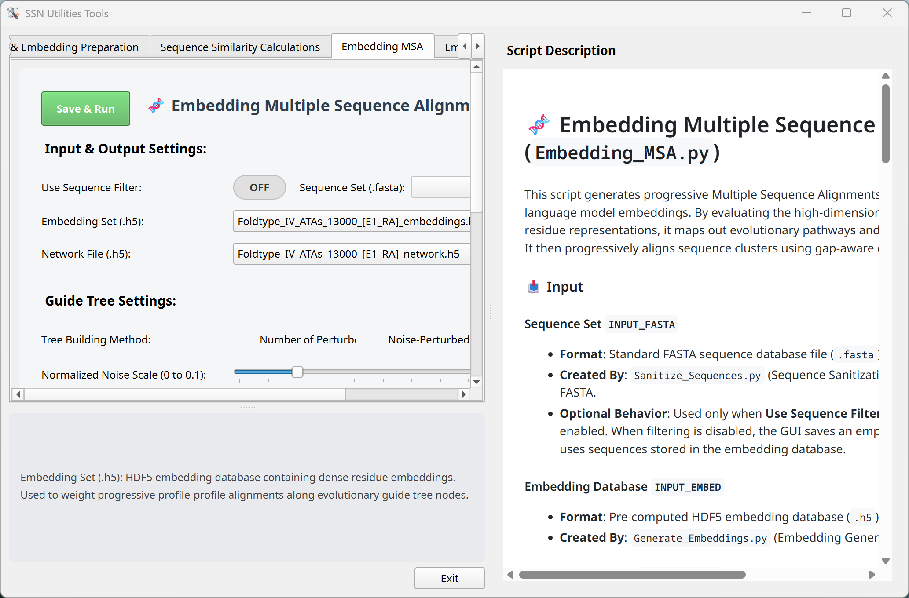
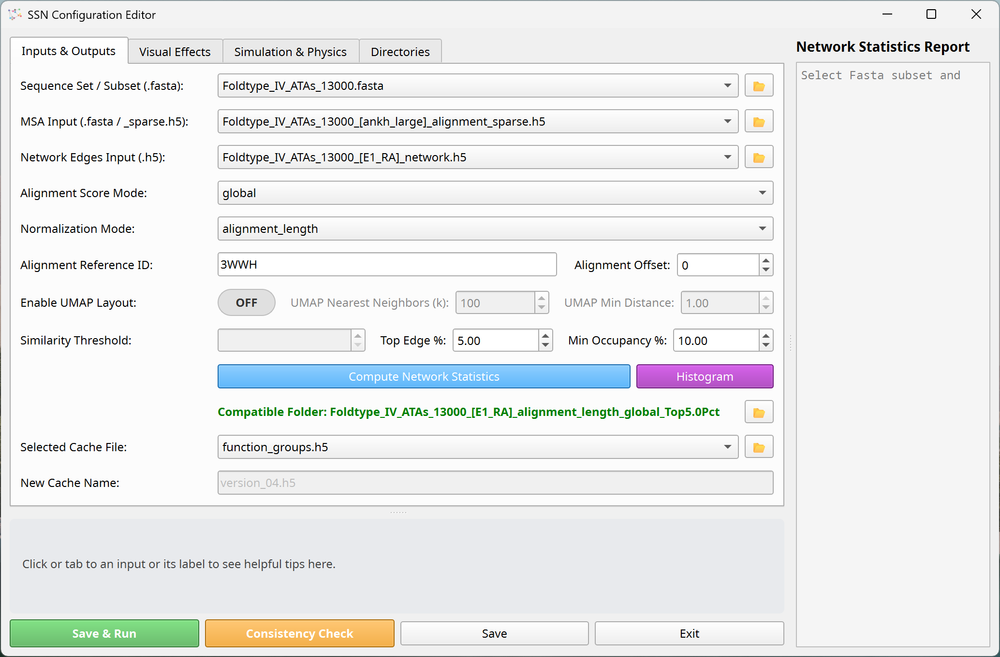
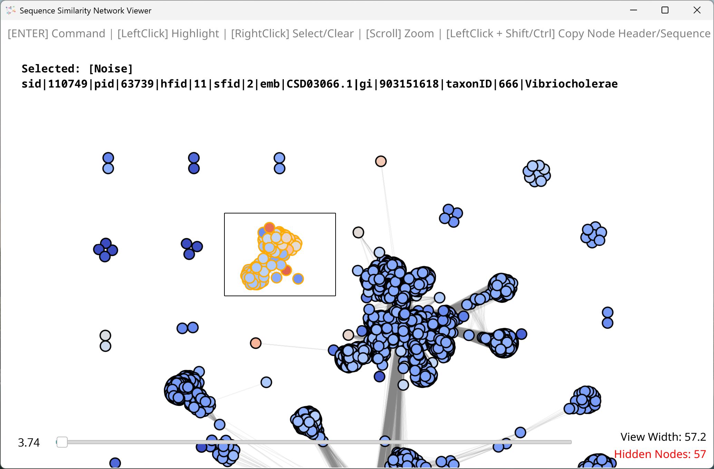

# Embedding-based Sequence Similarity Network (SSN) Viewer

[](https://www.python.org/)
[-lightgrey.svg)](https://github.com/)
[](LICENSE)
[](https://doc.qt.io/qtforpython/)
[](https://vispy.org/)

The **Embedding-based SSN Viewer (name: TBD)** is an interactive, high-performance graphical application designed to streamline the generation, visualization, and analysis of both traditional and embedding-based Sequence Similarity Networks (SSNs). By integrating **Multiple Sequence Alignments (MSAs)** directly into network exploration, the viewer bridges macroscopic sequence relationships with microscopic residue-level conservation, providing a comprehensive, multi-scale view of the protein sequence space.

---
## ⚠️ Important Note

1. **Cross-Platform Support**: Linux and Apple Silicon macOS support is currently under active development. Intel-based Macs are not supported.
2. **Work in Progress**: This documentation and the repository structure are undergoing active updates.
3. **Recommended Hardware**: An **NVIDIA GPU** is highly recommended for CUDA acceleration of embeddings and layout solvers. Intel Arc, AMD, and Apple Silicon GPUs are also supported via standard hardware acceleration backends. On macOS, only Apple Silicon Macs are supported.

---

## 📸 Overview

The application streamlines the entire SSN pipeline—from generation to interactive analysis—within a single unified workflow. It supports both traditional sequence similarity methods (e.g., BLAST) and modern embedding-based language model algorithms. Beyond dynamic visual formatting, the viewer provides an interactive command console with specialized commands tailored for deep analysis of the protein sequence space (see `list_of_commands.docx` for a detailed command reference).


---
## 🖥️ Graphical User Interface

### 🛠️ SSN Tools GUI

All calculations related to SSN generation are centralized in the `SSN_Tools.py` GUI. The interface is organized into intuitive tabs, each representing a distinct stage of the pipeline. It includes interactive tooltips at the bottom for parameter input fields and a script description panel on the right highlighting the function of each processing script.



### ⚙️ SSN Configuration GUI

The configuration GUI in `SSN_Config.py` simplifies input file selection and parameter tuning for SSN generation. It features a **Compute Network Statistics** utility that analyzes the network density and outputs a report in the right panel to guide the selection of an optimal similarity cutoff. Additionally, the **Consistency Check** utility compares the similarity network against the Multiple Sequence Alignment (MSA) to ensure sequence headers and indexes match perfectly across all files.



### 🔍 SSN Viewer GUI

The main visualization window, `SSN_Viewer.py`, serves as the interactive core for network exploration, formatting, and analysis. It provides full mouse and keyboard controls for 3D navigation and graphic customization, along with an in-line command console (HUD) to execute analytical operations, highlight specific residues, select clusters, and export figures.



---
## 🧬 System Workflow

The pipeline supports two primary pathways for Sequence Similarity Network (SSN) generation: a **traditional pathway** utilizing sequence alignment algorithms (like BLAST) and an **embedding-based pathway** driven by protein language models. Additionally, users can project sequences into 2D/3D space using UMAP based on pre-calculated embedding representations.


---

## 🚀 Key Features

*Work in Progress*

*   **Embedding-Based Dynamic Programming Alignment**: Align sequences using high-dimensional dense embedding similarity vectors instead of simple substitution matrices (BLOSUM/PAM), resolving structural and functional relationships even at low sequence identity.
*   **High-Performance Visualization**: Powered by PySide6 and VisPy, allowing real-time rendering, rotation, zooming, and manipulation of large networks containing thousands of nodes and edges.
*   **Integrated Command Console (HUD)**: Execute analytical commands (such as `zoom`, `select`, `color`, `cluster`, `subcluster`, and `logo`) directly inside the viewer viewport for instant formatting and analysis.
*   **Integrated Multiple Sequence Alignments (MSA)**: Bridge macroscopic network topology with residue-level conservation. Map conservation scores directly onto nodes and extract consensus sequence details interactively.
*   **Comprehensive Utilities Suite**: Centralized GUI in `SSN_Tools.py` supporting sequence sanitization, embedding generation (ESM, ProtBERT, ProstT5), network edge filtering, guide-tree MSA generation, and sequence extraction/injection.
*   **Cross-Platform Hardware Acceleration**: Automatic detection and utilization of CUDA (NVIDIA), Apple Silicon, Intel Arc, or AMD GPUs to accelerate embedding generation and force-directed layouts.

---

## ⚙️ Installation Steps

1. **Clone the repository:**
   Download or clone the repository to your computer.

2. **Set up the environment:**

   The generated Viewer and Tools launchers create a Python 3.12 environment
   and select one pinned PyTorch backend automatically. Detection is
   device-specific: recognizing a GPU makes it *eligible* for an installation
   attempt, while a tensor calculation on that device is required before it is
   recorded as *validated*. Unsupported or failed candidates are skipped in
   favor of the next compatible accelerator and, finally, the CPU build.

   | Hardware | Automatic backend policy |
   | --- | --- |
   | NVIDIA | CUDA 13.2 when every selected GPU and the installed driver qualify; otherwise CUDA 12.6. |
   | AMD on Windows 11 25H2 (build 26200+) | ROCm 7.14/PyTorch 2.12 first, then ROCm 7.2.1/PyTorch 2.9.1 when the GPU is present in both pinned support tables. |
   | AMD on earlier Windows 11 | ROCm 7.2.1 only for GPUs in AMD's corresponding Radeon/Ryzen support table. Windows 10 does not receive a native ROCm candidate. |
   | AMD on Linux | ROCm is attempted only for a mapped GFX target on a supported Ubuntu release when `/dev/kfd` is accessible; the installer does not install the system ROCm driver. |
   | Intel | XPU only for supported Arc, Core Ultra with Arc, or Data Center GPU Max devices on a listed OS. Intel HD/UHD graphics fall back to another accelerator or CPU. |
   | Apple | MPS on Apple Silicon only. Intel-based Macs are not supported. |

   The compatibility snapshot follows AMD's [current ROCm installer matrix](https://rocm.docs.amd.com/en/develop/install/rocm.html),
   [ROCm 7.2.1 Windows matrix](https://rocm.docs.amd.com/projects/radeon-ryzen/en/docs-7.2/docs/compatibility/compatibilityrad/windows/windows_compatibility.html),
   and PyTorch's [Intel XPU matrix](https://docs.pytorch.org/docs/main/notes/get_start_xpu.html).
   A newer GPU is deliberately treated as unsupported until it is added to the
   pinned application table.

   On multi-GPU computers, a compatible discrete GPU is preferred over an
   integrated GPU, followed by NVIDIA, AMD, and Intel within the same device
   class. Multiple validated NVIDIA or Intel devices remain available to the
   application's automatic benchmark. For a heterogeneous AMD integrated plus
   discrete configuration, only the preferred discrete GFX target is installed;
   the integrated adapter is reported as ignored. One backend-specific PyTorch
   build is installed per `.venv`, so GPUs from different vendors are not used
   simultaneously.

   The selected backend and per-device validation results are stored in
   `.venv/ssn_backend.json`. Hardware, driver, OS, requirements, or compatibility
   table changes invalidate that state automatically. To explicitly retry every
   eligible backend, run `src/Install_Dependencies.py` inside the managed virtual
   environment with `--refresh-backend`.

   Apple Silicon installation requires macOS 14 or newer, matching the pinned
   PyTorch wheel's deployment target.

   * **🪟 Windows**:
     Double-click `install.bat` in the project root to generate Windows Shortcuts (`.lnk` files) in the project root and optionally on your Desktop.
     
     > [!TIP]
     > It is highly recommended to enable **Developer Mode** in your Windows Settings (Search for "Developer settings" in Windows). This allows symbolic links to be created without elevation, which is required by the Hugging Face `transformers` cache model download system to avoid duplicating file storage.
     
     > [!IMPORTANT]
     > **Enable long path support.** Windows limits a full path to 260 characters by default, while Linux and macOS allow far longer. Generated outputs — predicted structure `.pdb` files in particular — are named after sequence headers, so a long header inside an already-deep project folder can exceed the limit and fail to write, even though the same run succeeds on Linux or macOS.
     >
     > Run this once in an **Administrator** PowerShell, then reboot:
     > ```powershell
     > New-ItemProperty -Path "HKLM:\SYSTEM\CurrentControlSet\Control\FileSystem" -Name "LongPathsEnabled" -Value 1 -PropertyType DWORD -Force
     > ```
     > Alternatively, enable **Computer Configuration → Administrative Templates → System → Filesystem → "Enable Win32 long paths"** in the Group Policy Editor (`gpedit.msc`).
     >
     > If you cannot change this setting, keep the project close to the drive root (for example `C:\SSN\`) rather than nested under a long folder chain such as a synced OneDrive directory. Note that external binaries invoked by the pipeline, such as NCBI BLAST, may not be long-path aware regardless of this setting — a short project path is the most reliable option.
     
   * **🍏 macOS (Apple Silicon only)**:
     Double-click `install.command` in the project root to configure permissions for scripts in `src/bin/` and generate double-clickable `.command` launchers (`SSN_Viewer.command` and `SSN_Tools.command`) in the project root.

     > [!IMPORTANT]
     > Only Apple Silicon Macs are supported. Intel-based Macs are not supported by the pinned PyTorch runtime.
     
     > [!NOTE]
     > If you downloaded the project as a ZIP rather than cloning it, the executable permission is not preserved. Restore it with `chmod +x install.command` before double-clicking.
     
   * **🐧 Linux**:
     SSN Tools renders its documentation panel with QtWebEngine, which ships inside PySide6 but links against system libraries that `pip` cannot install. Install them first:
     ```bash
     sudo apt install libnss3 libnspr4 libxcomposite1 libxdamage1 libxrandr2 \
                      libxkbcommon-x11-0 libxtst6 libgbm1 libegl1 libxslt1.1 \
                      libasound2t64 libcups2t64
     ```
     > [!NOTE]
     > On Ubuntu 22.04 and older, use `libasound2` and `libcups2` — the `t64` suffix only exists on 24.04 and newer. On Fedora/RHEL the equivalent is:
     > ```bash
     > sudo dnf install nss nspr libXcomposite libXdamage libXrandr libxkbcommon-x11 \
     >                  libXtst mesa-libgbm mesa-libEGL libxslt alsa-lib cups-libs
     > ```
     > If SSN Tools still reports a missing library, it names the exact file — install whichever package provides it.

     Then run the installation script:
     ```bash
     cd Sequence_Similarity_Network_Viewer
     ./install.sh
     ```
     This will configure execution permissions and generate launchers (`SSN_Viewer` and `SSN_Tools`) as well as system `.desktop` application entries.

---

## 🔧 Linux Troubleshooting

* **Blank or black 3D canvas on a Wayland session.**
  The launchers set `QT_QPA_PLATFORM=xcb` automatically on Wayland, because the OpenGL canvas is unreliable on the native Wayland platform plugin. To opt back into native Wayland, set the variable yourself before launching:
  ```bash
  QT_QPA_PLATFORM=wayland ./SSN_Viewer
  ```

* **SSN Tools exits immediately, or crashes inside Chromium.**
  If the documentation panel fails after the libraries above are installed — common inside containers or on hardened kernels where the Chromium sandbox cannot start — disable the sandbox:
  ```bash
  QTWEBENGINE_CHROMIUM_FLAGS=--no-sandbox ./SSN_Tools
  ```

* **`unable to lock file` when opening an HDF5 network.**
  HDF5 file locking fails on NFS and some network home directories. Set `HDF5_USE_FILE_LOCKING=FALSE` before launching.

---

## 📂 File Structure

```directory
Sequence_Similarity_Network_Viewer/
│
├── install.bat               # Windows installer (creates .lnk shortcuts)
├── install.command           # macOS installer (creates double-clickable launchers)
├── install.sh                # Linux installer (creates symlinks and desktop entries)
│
├── src/                      # Source code directory
│   ├── SSN_Viewer.py         # Main PySide6 / VisPy desktop visualization application
│   ├── SSN_Tools.py          # GUI & CLI utility for generating network data & computing layouts
│   ├── SSN_Config.py         # GUI configuration manager for inputs, thresholds, and models
│   ├── SSN_Utils.py          # Shared utility functions (IO, math helper, parsing)
│   │
│   ├── bin/                  # Startup scripts and launchers
│   │   ├── SSN_Viewer.bat    # Windows Viewer startup script
│   │   ├── SSN_Tools.bat     # Windows Tools startup script
│   │   ├── SSN_Viewer.sh     # Linux/macOS Viewer startup script
│   │   ├── SSN_Tools.sh      # Linux/macOS Tools startup script
│   │   └── logos/            # Application custom icon files (.png and .ico)
│   │
│   ├── commands/             # Command modules for interactive viewer console
│   ├── resources/            # Configuration and system prompts
│   ├── tools/                # Executable processing scripts exposed by SSN_Tools
│   │   └── tool_descriptions/# Markdown documentation displayed by the Tools GUI
│   ├── utilities/            # Shared hardware, HDF5, alignment, and FASTA helpers
│   └── web_ui/               # Embedded web UI backend and interfaces
│
├── docs/                     # Documentation screenshots and descriptions
├── Input_Files/              # Raw input sequence FASTA files
├── Cache_Files/              # Cached layouts, metadata, splits, and lists
├── Embeddings/               # Directory where ESM protein embeddings are cached
└── Results/                  # Visual outputs, exported graphs, and layouts
```

---

## 🤝 Contributing

Contributions are welcome! Please feel free to open Issues or submit Pull Requests to enhance computational efficiency, layout performance, UI responsiveness, or commands for analyses.

## 📄 License

Copyright 2026 Xuebin Feng

Licensed under the Apache License, Version 2.0 (the "License"); you may not use
this file except in compliance with the License. You may obtain a copy of the
License at

    http://www.apache.org/licenses/LICENSE-2.0

Unless required by applicable law or agreed to in writing, software distributed
under the License is distributed on an "AS IS" BASIS, WITHOUT WARRANTIES OR
CONDITIONS OF ANY KIND, either express or implied. See the [LICENSE](LICENSE)
file for the specific language governing permissions and limitations under the
License, and [NOTICE](NOTICE) for required attributions.

### Third-party components

This repository bundles the MIT-licensed ESM wheel, Mol*, and Tabulator, depends
on Python packages under a range of licenses, and can load
protein-language-model weights governed by their own terms. A full inventory,
including which components are redistributed and which are merely required at
runtime, is in
[THIRD_PARTY_LICENSES.md](THIRD_PARTY_LICENSES.md).

The optional Ankh weights are licensed separately under **CC BY-NC-SA 4.0** and
are restricted to non-commercial use. The application labels these models and
requires explicit acknowledgement before accessing their files; the integration
code remains Apache-2.0 and does not redistribute the weights.

The GUI uses **PySide6 under its LGPL-3.0 option**. PySide6 and Qt are installed
separately and are not included in this source repository. Any future executable
or installer that redistributes Qt binaries needs a separate LGPL compliance
review.

The repository bundles an unmodified ESM 3.3.0 wheel built from the upstream
MIT-licensed source commit. Its source commit, SHA-256, and adjacent license are
recorded under `src/resources/wheels/`; model weights remain separately
downloaded and retain their publishers' licenses. See sections 1 and 5 of
[THIRD_PARTY_LICENSES.md](THIRD_PARTY_LICENSES.md).

Before publishing a release, confirm that copyright ownership and release
authority have been resolved and that all required technical gates pass.
